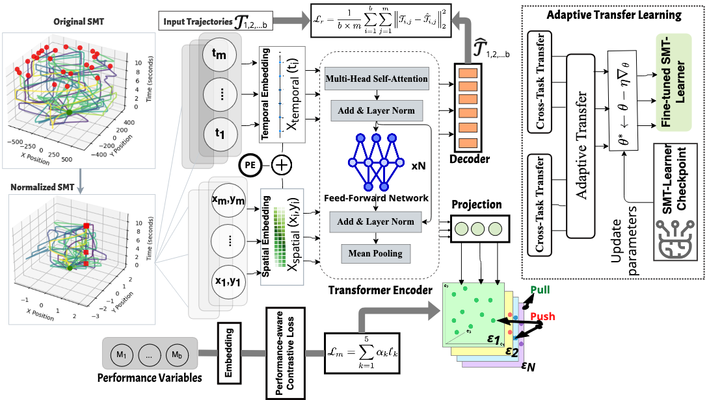

# SMT-LEARNER: MOVEMENT TRAJECTORY LEARNING TO DECODE MOTOR CONTROL STRATEGIES

## Decoding Movement Patterns During Motor Skill Learning

[](https://www.python.org/downloads/)
[](https://pytorch.org/)
[](https://www.mathworks.com/products/matlab.html)
[](https://opensource.org/licenses/MIT)
[](https://arxiv.org/abs/2024.xxxx)


## 🎯 Overview

SMT-Learner is a transformer-based framework that learns meaningful representations of human movement patterns during motor skill acquisition. By leveraging contrastive learning principles and Adaptive transfer learning, SMT-Learner captures the temporal dynamics and spatial relationships in movement trajectories, enabling effective analysis of skill learning processes across different tasks and subjects.

## 🏗️ Architecture




## 🚀 Quick Start

### Installation

```bash
cd SMT-Learner

# Create conda environment
conda create -n stcrl python=3.8
conda activate stcrl

# Install dependencies
pip install -r requirements.txt
```

### Basic Usage

```python
import torch
from STCRL import STCRLTransformer, MultiTemporalLoss
from STCRL.TransferLearning import STCRLTransferLearningRunner

# Initialize model
model = STCRLTransformer(
    seq_len=512,
    input_dim=3,  # x, y, t coordinates
    hidden_dim=256,
    nhead=8,
    num_layers=3
)

# Initialize adaptive loss function
loss_fn = MultiTemporalLoss(
    weights=(0.3, 0.2, 0.2, 0.2, 0.1),
    within_subject_weight=0.7
)

# Train model
from STCRL.TrainSTCRL import train_stcrl_model
model, optimizer, history = train_stcrl_model(
    train_df, 
    loss_fn=loss_fn,
    hidden_dim=256,
    epochs=50
)
```

### Transfer Learning

```python
# Cross-subject transfer learning
runner = STCRLTransferLearningRunner("path/to/source/model")

# Run comprehensive transfer learning study
results, histories = runner.run_comprehensive_transfer_study(target_df)

# Cross-task transfer with progressive unfreezing
ct_model, ct_history, ct_results = runner.run_cross_task_transfer(
    target_df, epochs=15
)
```

## 📊 Dataset

STCRL is designed to work with 3D movement trajectory data collected during motor skill learning tasks. The expected data format includes:

- **Trajectory Data**: 2D coordinates (x, y) and timestamp (t) sampled at regular intervals
- **Task Metadata**: Task type, success status, RMSD, Completion Time
- **Subject Information**: Participant ID for cross-subject analysis
- **Performance Metrics**: RMSD (Root Mean Square Deviation), completion time, success status

**Dataset 1: Human Movement Data**

Publish with paper.

**Dataset 2: Monkey Hand Movement**

Stephen H Scott et al. “Dissociation between hand motion and population vectors from neural activity in
motor cortex”. In: Nature 413.6852 (2001), pp. 161–165.
URL: [https://portal.nersc.gov/project/crcns/download/index.php](https://portal.nersc.gov/project/crcns/download/index.php)


## 📈 Evaluation

### Comprehensive Metrics

- (i) **Trajectory reconstruction quality**: Reconstruction Mean Squared Error (rMSE), Mean Endpoint Error (Ep-Err), and Mean Curvature Error (Curve-Err).
- (ii) **Statistical correlation with movement performance variables**: Completion time correlation (T-Corr; movement speed), correlation with root mean square deviation from the optimal path (R-Corr; movement accuracy), and correlation with successfully reaching the target (S-Corr; success prediction AUC).
- (iii) **Clustering neighborhood consistency**: Trajectory shape consistency (Traj-C), cross-task consistency (Task-C), and cross-subject consistency (Sub-C).

## 📋 Requirements

```
torch>=2.0.0
numpy>=1.21.0
pandas>=1.3.0
scikit-learn>=1.0.0
matplotlib>=3.5.0
seaborn>=0.11.0
scipy>=1.7.0
tqdm>=4.62.0
```


## 📄 License

This project is licensed under the MIT License - see the [LICENSE](LICENSE) file for details.


**SMT-Learner** - Advancing the understanding of human motor learning through deep representation learning